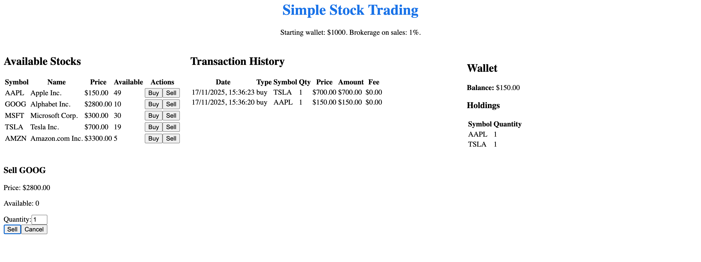

# Simple Stock Trading Web Application

## Objective
Develop a simple stock trading web application that allows users to view, buy, and sell stocks while managing their wallet and applying brokerage fees.

## UI Preview

## Features

1. **View Available Stocks**
   - Display a list of stocks with:
     - Stock symbol (e.g., AAPL, GOOG)
     - Current price per stock
     - Available stock quantity

2. **User Wallet**
   - Each user starts with a wallet balance of $1000
   - Wallet updates automatically after buying or selling stocks

3. **Buying Stocks**
   - Users can buy any number of stocks, if they have sufficient funds
   - Wallet balance is updated according to stock price and quantity
   - Purchases are prevented if:
     - Requested quantity exceeds available stocks
     - Wallet balance is insufficient

4. **Selling Stocks**
   - Users can sell any stock they own
   - Deducts 1% brokerage fee on the total sale value
   - Wallet balance is updated after deducting brokerage fee

5. **Transaction History**
   - Maintains a log of all transactions including:
     - Stock symbol
     - Number of stocks
     - Transaction type (buy/sell)
     - Amount involved
     - Brokerage fees (for sales)

